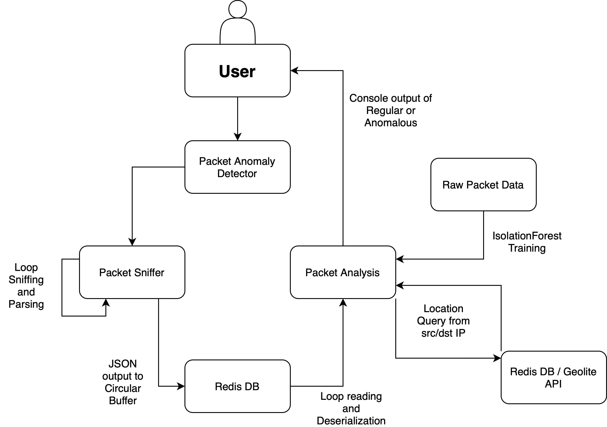
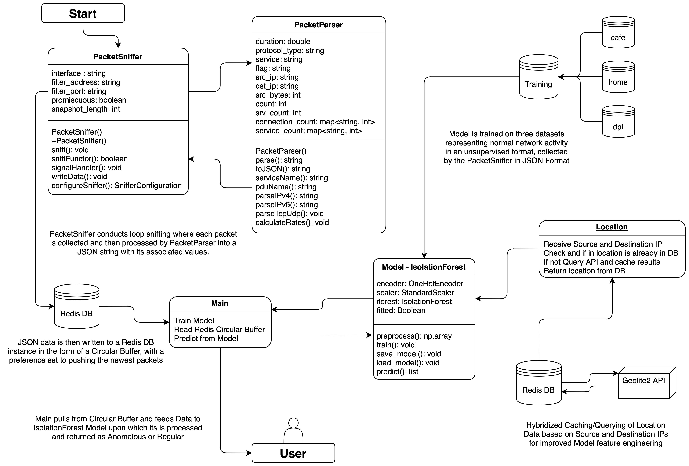

# Real-Time Network Packet Anomaly Detection

## Overview

This project is designed to detect anomalous network packets in real-time using machine learning techniques. By analyzing network traffic data, the system identifies deviations from normal patterns, which can signal potential security threats or network anomalies.

### Key Features

- **Real-Time Packet Analysis**: Continuously monitors incoming network packets using Loop Sniffing techniques.
- **Unsupervised Anomaly Detection**: Employs ensemble machine learning methods, specifically Isolation Forests, to identify unusual patterns in network traffic.
- **IP Geolocation Integration**: Interfaces with external IP-to-location databases and APIs to enhance anomaly detection by providing contextual location data.
- **JSON Data Handling**: Manages packet data in JSON format, ensuring flexible and structured data representation.

## Project Tree
```
packet-anomaly-detection/
├── data/
│   ├── cafe-data
│   ├── dpi-data
│   ├── home-data
│   └── mixed-anomaly
├── packet-analysis/
│   ├── tests/
│   │   ├── test_location.py
│   │   └── test_main_model.py
│   ├── location.py
│   ├── main.py
│   ├── model.py
│   └── requirements.txt
├── packet-sniffer/
│   ├── build/
│   ├── external/
│   │   └── cpp_redis/
│   ├── include/
│   │   ├── packet_parser.hpp
│   │   └── packet_sniffer.hpp
│   ├── src/
│   │   ├── packet_parser.cpp
│   │   └── packet_sniffer.cpp
│   └── CMakeLists.txt
└── start_program.sh
```

## Architecture

### High Level


### Low Level


## Prerequisites

Before installing and running the project, ensure you have the following:

- Python 3.8 or later
- Required Python packages (see `requirements.txt`)
- C++ compiler (for packet-sniffer module)
- Required C++ Libraries (see  `packet-sniffer/README.md`)
- API keys for IP-to-location services

## Getting Started

### Installation

1. **Clone the Repository**  
   First, clone the repository to your local machine:

   ```bash
   git clone https://github.com/adityaramesh15/packet-anomaly-detection
   ```

2. **Configuration**  
   Make sure to configure any necessary environment variables or settings, such as API keys for external IP-to-location services. Specifics about installation for each portion of the project are located in their respective `README.md` documents.

### Running

1. **Setup Permissions**
    ```bash
    chmod +x start_program.sh
    ```
2. **Create and Activate Virtual Environment**
   ```bash
   python3 -m venv .venv
   source .venv/bin/activate
   pip3 install -r ./packet-analysis/requirements.txt
   ```
3. **Run Script**

   ```bash
   ./start_program.sh
   ```
4. **End Script**
   Terminate Program by giving Ctrl-C for SIGINT

## Usage
Once the system is running, you can interact with it via the command line. Editing the output of `main.py` will redirect where the output of the `IsolationTree` model goes. 

## Troubleshooting

If you encounter issues, please check the following:
- Ensure all dependencies are installed correctly.
- Verify API keys and configurations for external services.

## Limitations

- **False Positives**: The current model may generate false positives, particularly when the network environment changes or there is a significant deviation from previously learned patterns.
- **Real-Time Processing**: Due to the complexity of real-time processing and the volume of network traffic, the system may experience delays or lag in detecting anomalies.
- **Dependency on External Services**: The accuracy and reliability of the IP geolocation feature depend on the availability and precision of external APIs and databases.

## Future Plans

- **Enhanced Model Accuracy**: Improve the accuracy of anomaly detection by incorporating additional data sources and refining feature selection.
- **Scalability**: Optimize the system to handle higher volumes of network traffic, potentially by distributing processing across multiple nodes.
- **User Interface**: Develop a user-friendly interface to visualize detected anomalies and network activity.
- **Expanded Geolocation Data**: Integrate more comprehensive geolocation data sources to improve the contextual understanding of network packets.

## Contribution Guidelines

I welcome contributions from the community! To contribute:

1. **Fork the Repository**: Start by forking the repository on GitHub.
2. **Create a New Branch**: Create a new branch for your feature or bug fix.
3. **Make Your Changes**: Implement your changes and commit them with clear, descriptive messages.
4. **Submit a Pull Request**: Once your changes are complete, submit a pull request with a detailed description of your changes.

Please ensure that your code adheres to the project's coding standards and includes appropriate tests where necessary. For significant changes, please open an issue first to discuss what you would like to change.

## License

This project is licensed under the MIT License. See the [LICENSE](LICENSE) file for details.


