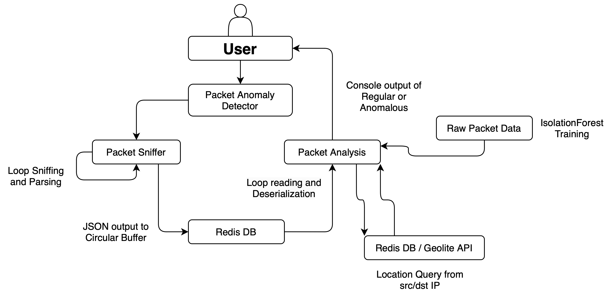

# Real-Time Network Packet Anomaly Detection

## Overview

This project is designed to detect anomalous network packets in real-time using machine learning techniques. By analyzing network traffic data, the system identifies deviations from normal patterns, which can signal potential security threats or network anomalies.

### Key Features

- **Real-Time Packet Analysis**: Continuously monitors incoming network packets using Loop Sniffing techniques.
- **Unsupervised Anomaly Detection**: Employs ensemble machine learning methods, specifically Isolation Forests, to identify unusual patterns in network traffic.
- **IP Geolocation Integration**: Interfaces with external IP-to-location databases and APIs to enhance anomaly detection by providing contextual location data.
- **JSON Data Handling**: Manages packet data in JSON format, ensuring flexible and structured data representation.

## Getting Started

### Installation

1. **Clone the Repository**  
   First, clone the repository to your local machine:

   ```bash
   git clone https://github.com/adityaramesh15/packet-anomaly-detection
   ```

2. **Configuration**  
   Make sure to configure any necessary environment variables or settings, such as API keys for external IP-to-location services. Specifics about installation for each portion of the project are located in their respective `README.md` documents.

### Running

1. **Setup Permissions**
    ```bash
     chmod +x start_program.sh
    ```
2. **Run Script**

   ```bash
   ./start_program.sh
   ```


## Project Tree
```
.
└── packet-anomaly-detection/
    ├── data/
    │   ├── cafe-data
    │   ├── dpi-data
    │   ├── home-data
    │   └── mixed-anomaly
    ├── packet-analysis/
    │   ├── tests/
    │   │   ├── test_location.py
    │   │   └── test_main_model.py
    │   ├── location.py
    │   ├── main.py
    │   ├── model.py
    │   └── requirements.txt
    ├── packet-sniffer/
    │   ├── build/
    │   ├── external/
    │   │   └── cpp_redis/
    │   ├── include/
    │   │   ├── packet_parser.hpp
    │   │   └── packet_sniffer.hpp
    │   ├── src/
    │   │   ├── packet_parser.cpp
    │   │   └── packet_sniffer.cpp
    │   └── CMakeLists.txt
    └── start_program.sh
```

## Architecture

### High Level


### Low Level
